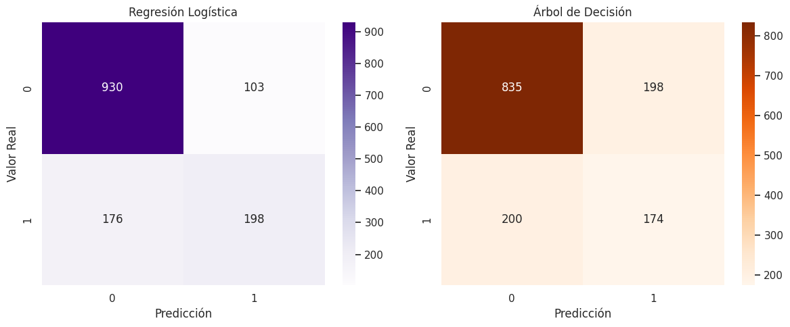
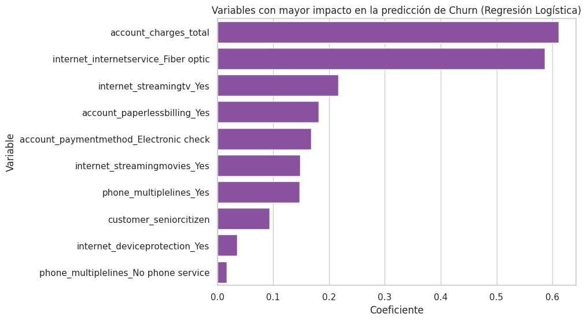
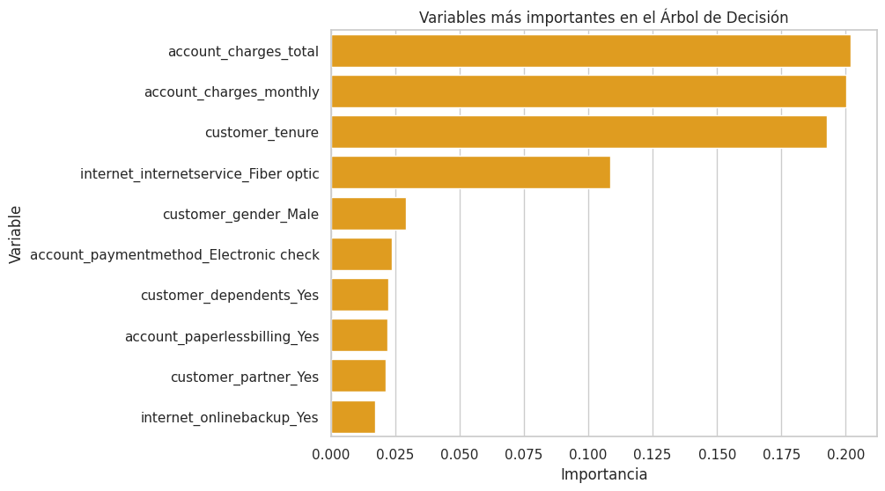

# 📡 Telecom X — Predicción de Churn con Machine Learning

Proyecto de **Ciencia de Datos y Machine Learning** enfocado en identificar clientes con mayor probabilidad de cancelar sus servicios (*churn*) en Telecom X.

Este análisis combina **preprocesamiento de datos, análisis exploratorio, modelado predictivo e interpretación de resultados** para generar insights que ayuden a mejorar la **retención de clientes**.

---

# 📊 Objetivo del proyecto

El objetivo principal es **desarrollar modelos predictivos capaces de anticipar qué clientes tienen mayor riesgo de cancelar el servicio**, permitiendo a la empresa implementar estrategias de retención más efectivas.

---

# 🧠 Habilidades aplicadas

- 🧹 Preprocesamiento de datos
- 🔎 Análisis exploratorio de datos (EDA)
- 📈 Análisis de correlación
- 🤖 Machine Learning para clasificación
- 📊 Evaluación de modelos
- 🧠 Interpretación de variables importantes
- 💡 Generación de insights estratégicos

---

# 📂 Estructura del repositorio

telecomx-churn/
│
├── TelecomX_Churn_Parte2.ipynb
├── telecomx_limpio.csv
├── README.md
└── img/
├── correlacion_churn.png
├── matriz_confusion_modelos.png
└── variables_importantes.png

| Archivo | Descripción |
|------|------|
| 📓 `TelecomX_Churn_Parte2.ipynb` | Notebook con todo el análisis y modelado |
| 📁 `telecomx_limpio.csv` | Dataset limpio utilizado en el proyecto |
| 📄 `README.md` | Documentación del proyecto |

---

# 📊 Dataset

El dataset contiene información sobre clientes de Telecom X, incluyendo características como:

- antigüedad del cliente
- tipo de contrato
- servicios contratados
- cargos mensuales y totales
- método de pago
- cancelación del servicio

Variable objetivo:

churn

---

# 🔎 Análisis exploratorio de datos

Se realizó un análisis para identificar patrones asociados con la cancelación.

Entre los análisis realizados:

- distribución de churn
- análisis de correlación
- relación entre antigüedad del cliente y cancelación
- relación entre cargos mensuales y churn

---

# 🤖 Modelos de Machine Learning

Se entrenaron dos modelos de clasificación:

| Modelo | Descripción |
|------|------|
| 📈 **Regresión Logística** | Modelo lineal utilizado para predecir la probabilidad de cancelación |
| 🌳 **Árbol de Decisión** | Modelo basado en reglas que divide los datos en nodos |

---

# 📊 Evaluación de modelos

Se evaluaron los modelos utilizando:

- Accuracy
- Precision
- Recall
- F1-score
- Matriz de confusión

### Comparación de resultados

| Modelo | Accuracy | Recall (churn) | F1-score |
|------|------|------|------|
| 📈 Regresión Logística | **0.80** | **0.53** | **0.59** |
| 🌳 Árbol de Decisión | 0.72 | 0.47 | 0.47 |

📌 El modelo de **Regresión Logística presentó el mejor desempeño general**.

---

# 📊 Matrices de confusión

Comparación visual del desempeño de ambos modelos.

---

# 🔎 Variables más importantes

El análisis de importancia de variables permitió identificar factores clave asociados con el churn.

Entre los más relevantes destacan:

| Variable | Impacto |
|------|------|
| `customer_tenure` | clientes con menor antigüedad presentan mayor probabilidad de cancelar |
| `account_charges_monthly` | cargos mensuales altos aumentan la probabilidad de churn |
| `account_charges_total` | el gasto total del cliente influye en la cancelación |
| `internet_internetservice_Fiber optic` | usuarios de fibra óptica presentan mayor churn |
| `account_paymentmethod_Electronic check` | método de pago asociado con mayor cancelación |

### Importancia de variables

---

# 💡 Principales insights

El análisis sugiere que la cancelación de clientes está relacionada principalmente con:

- 💰 el nivel de gasto del cliente
- ⏳ la antigüedad en la empresa
- 🌐 el tipo de servicio contratado
- 💳 el método de pago utilizado

Estos factores aparecen de manera consistente en los diferentes modelos analizados.

---

# 📉 Estrategias de retención sugeridas

Basándose en los resultados obtenidos, Telecom X podría considerar estrategias como:

- 🎯 desarrollar programas de fidelización para clientes nuevos
- 💰 revisar la estructura de precios o mejorar la percepción de valor del servicio
- 🌐 evaluar la experiencia de los usuarios con el servicio de fibra óptica
- 🎁 ofrecer incentivos para contratos de mayor duración
- 💳 promover métodos de pago automáticos que favorezcan la permanencia del cliente

---

# 🧪 Tecnologías utilizadas

- Python 🐍
- pandas
- numpy
- matplotlib
- seaborn
- scikit-learn

---

# 👩‍💻 Autor

Proyecto realizado por:

**Andrea T. Valdés**

---

Este proyecto es parte de un ejercicio del curso de Data Science de Alura LATAM - Oracle Next Education
